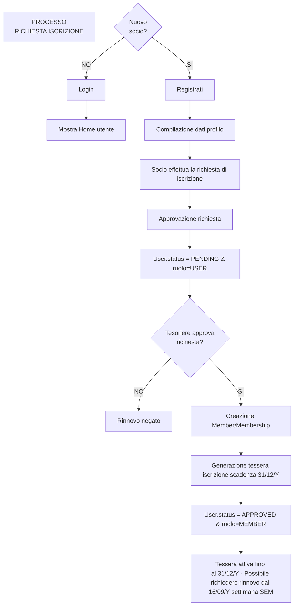
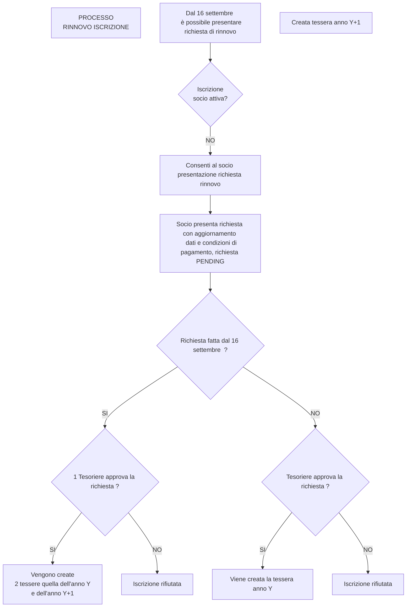

# 📘 Manuale Utente — NoProfit4Us (Versione Dettagliata)

---

## Sommario

- [Capitolo 1 — Processo di Iscrizione/Rinnovo](#capitolo-1--processo-di-iscrizione-rinnovo)
  - [Diagramma Registrazione](#diagramma-registrazione)
  - [1.1 Registrazione sul sito](#11-registrazione-sul-sito)
  - [1.2 Compilazione dati anagrafici](#12-compilazione-dati-anagrafici)
  - [1.3 Richiesta di approvazione](#13-richiesta-di-approvazione-flusso-amministrativo)
  - [1.4 Rinnovo della tessera](#14-rinnovo-della-tessera)
  - [Diagramma rinnovo della tessera](#diagramma-rinnovo-della-tessera)
- [Capitolo 2 — Gestione Gadget](#capitolo-2--gestione-gadget)
  - [2.1 Catalogo Gadget](#21-catalogo-gadget)
    - [2.1.1 Come inserire un nuovo gadget](#211-come-inserire-un-nuovo-gadget)
    - [2.1.2 Come modificare un gadget esistente](#212-come-modificare-un-gadget-esistente)
    - [2.1.3 Come clonare un gadget](#213-come-clonare-un-gadget)
    - [2.1.4 Come eliminare un gadget](#214-come-eliminare-un-gadget)
    - [2.1.5 Tabella catalogo gadget – cosa mostra e come usarla](#215-tabella-catalogo-gadget--cosa-mostra-e-come-usarla)
    - [2.1.6 Controlli e regole di validazione](#216-controlli-e-regole-di-validazione)
  - [2.2 Gestione Stock Gadget](#22-gestione-stock-gadget)
    - [2.2.1 Panoramica della dashboard KPI](#221-panoramica-della-dashboard-kpi)
    - [2.2.2 Tabella giacenze per gadget](#222-tabella-giacenze-per-gadget)
    - [2.2.3 Come registrare un movimento di magazzino](#223-come-registrare-un-movimento-di-magazzino)
    - [2.2.4 I sei tipi di movimento: scopo e funzionamento passo‑passo](#224-i-sei-tipi-di-movimento--scopo-e-funzionamento-passo‑passo)
      - [🟢 RESTOCK — Rifornimento](#️-restock--rifornimento)
      - [🔵 TRANSFER — Trasferimento](#️-transfer--trasferimento)
      - [🟠 DELIVERY — Consegna definitiva a socio o altra persona](#️-delivery--consegna-definitiva-a-socio)
      - [🟣 LOAN — Affidamento temporaneo](#️-loan--affidamento-temporaneo)
      - [🟢 LOAN_RETURN — Riconsegna di un affidamento](#️-loan_return--riconsegna-di-un-affidamento)
      - [🔵 LOAN_DELIVERY — Consegna definitiva da un affidamento](#️-loan_delivery--consegna-definitiva-da-un-affidamento)
    - [2.2.5 Dettagli sugli affidamenti (Loans)](#225-dettagli-sugli-affidamenti-loans)
    - [2.2.6 Storico movimenti e esportazione inventario](#226-storico-movimenti-e-esportazione-inventario)
    - [2.2.7 Controlli e regole di validazione dei movimenti](#227-controlli-e-regole-di-validazione-dei-movimenti)
  - [2.3 Gestione Magazzini](#23-gestione-magazzini)
    - [2.3.1 Creazione e modifica di un magazzino](#231-creazione-e-modifica-di-un-magazzino)
    - [2.3.2 Tabella magazzini – cosa mostra e come usarla](#232-tabella-magazzini--cosa-mostra-e-come-usarla)
    - [2.3.3 Controlli di validazione sui magazzini](#233-controlli-di-validazione-sui-magazzini)

---

# Capitolo 1 — Processo di Iscrizione/Rinnovo

Il percorso di **iscrizione** di un nuovo socio e quello di **rinnovo** per i soci esistenti è schematizzato in questo workflow:
Dopo la registrazione, un utente entra a sistema con profilo incompleto, una volta pagata la quota come socio ordinario o sostenitore, compilati i dati personali e aver pagato, presenta la richiesta di iscrizione. Il processo di accettazione della richiesta produce la generazione della tessera numerata per il socio a cui verrà assegnato il ruolo di membro. 

Da gennaio fino alla data di inizio della Settimana Europea Mobilità, 16 settembre di ogni anno, il socio può aggiornare i dati anagrafici del suo profilo ma non cambiare la modalità di pagamento. Dal 16 settembre il socio ha sbloccata la possibilità di inserire la richiesta di rinnovo per l'anno successivo. 

Una volta accettata dalla tesoreria sulla sua home compariranno la tessera dell'anno corrente attiva e quella dell'anno successivo che cambierà colorazione a partire da gennaio dell'anno nuovo.

A un membro dell'associazione possono essere assegnati i ruoli di segreteria per la gestione dei gadget e magazzino o il ruolo di tesoriere che permette di gestire il flusso di accettazione e generazione delle tessere dei soci. Il ruolo admin serve a gestire i ruoli degli altri utenti e può svolgere anche le attività del ruolo segretario e tesoriere.

Con queste istruzioni il socio può capire **passo‑passo** come avviene l’iscrizione, la verifica da parte dell’amministratore e il meccanismo di rinnovo, così come è implementato nel codice.

### Diagramma registrazione

  

---

### 1.1 Registrazione sul sito

1. **Apri la pagina di login** (Home). Se non sei ancora autenticato, il banner di benvenuto mostra il form di accesso/registrazione.
2. **Clicca su “Nuovo Utente”** per attivare la modalità registrazione.
3. **Compila email e password** e premi il pulsante **«Registrati»**.
4. Viene inviato un link di conferma all’indirizzo email fornito.
5. Dopo il click sul link, l’utente ritorna al sito con lo status **`INCOMPLETE`** (vedi caso 2).
6. Dal 16 settembre il socio otterrà iscrizione per l'anno Y e l'anno successivo Y+1

---

### 1.2 Compilazione dati anagrafici

1. Dopo il login, il caso **`INCOMPLETE`** mostra una card con un pulsante **«Inizia la procedura di iscrizione»** .
2. Il wizard raccoglie i dati personali, il tipo di socio (`ORDINARIO` o `SOSTENITORE`) e il metodo di pagamento.
3. Al salvataggio, lo status dell'utente sarà `'PENDING'` e sarà registrato il metodo di pagamento.

---

### 1.3 Richiesta di approvazione (flusso amministrativo)

1. Un amministratore/tesoriere visualizza sulla sua interfacci di amministrazione la lista degli utenti `PENDING` e  può **“Approvare”** o **Rifutare”** la richiesta.
2. Il socio vede il nuovo stato **`APPROVED`** o **`REJECTED`** nella Home (APPROVATO oppure RIFIUTATO).
3. Nel caso di rifiuto il tesoriere **`DEVE`** scrivere mail al socio per la restituzione della quota versata e avviare la procedura di rimborso.
---

### 1.4 Rinnovo della tessera

1. Dal 16 settembre quando il socio può richiedere rinnovo tramite **«Richiedi Rinnovo»** .
2. L’utente aggiorna **Tipo Socio** e **Metodo di Pagamento**  e presenta la richiesta.
3. La sua richiesta rimane `PENDING` fino ad accettazione o rifiuto del tesoriere
4. Una volta accettata la sua richiesta 

---

### Diagramma rinnovo della tessera

  

---

### Cosa vedere nella Home

| Stato UI | Descrizione | Azione disponibile |
|---|---|---|
| `INCOMPLETE` | Socio appena registrato, dati mancanti | **Avvia wizard** → completa profilo |
| `PENDING` | Richiesta approvazione in sospeso | Nessuna azione (attende admin) |
| `APPROVED` | Tessere attive visualizzate | **Rinnova** (se `needsRenewal`) |
| `REJECTED` | Iscrizione rifiutata | Contatta amministratore |

---

## Capitolo 2 — Gestione Gadget

Il modulo **Gadget** è il cuore dell’applicazione: qui si definiscono tutti gli articoli (t‑shirt, cappellini, ecc.) e si gestiscono le loro giacenze nei diversi magazzini definibili dall'utente con ruolo TESORIERE.

Le operazioni sono pensate per essere intuitive, ma richiedono attenzione a certi dettagli (es. lo stato *“Non in vendita”*). Di seguito trovi una guida completa.

Ci si accede dal menu laterale

---

### 2.1 Catalogo Gadget

La pagina **Gadgets** (accessibile dal menu laterale → **Gadget**) elenca tutti i gadget già presenti nel sistema e ti consente di crearne di nuovi, modificarli, clonarli o eliminarli.

#### 2.1.1 Come inserire un nuovo gadget

1. **Accedi al menu “Gadget”.**
2. In alto a destra trovi il pulsante **«Nuovo Gadget»** (icona `+ Nuovo Gadget`). Cliccalo.
3. Si apre una **finestra di dialogo** con il form di creazione.
4. **Compila i campi**:
   - **Non in vendita** (checkbox). *Spunta questa opzione solo se il gadget non sarà proposto al pubblico* (es. gadget di uso interno, materiale promozionale interno). Quando è attiva, il gadget è invisibile agli utenti non autenticati e **non può essere consegnato** tramite le operazioni di *Delivery* o *Loan Delivery*.
   - **Nome** – inserisci il nome descrittivo (es. `T‑Shirt 2024`).
   - **Categoria** – scegli una delle categorie disponibili (T‑Shirt, Cappellino, Portachiavi, …). Questa informazione è usata per raggruppare i gadget nei report.
   - **Donazione minima** – indica l’importo minimo di donazione richiesto per ricevere il gadget (es. `10,00 €`). Il campo accetta solo valori numerici ≥ 0, con due decimali.
   - **Descrizione** – opzionale, fornisci dettagli aggiuntivi.
   - **SKU** – codice unico. Se lasciato vuoto, il sistema lo **genererà automaticamente** al salvataggio usando il pattern `CAT‑TAG‑COLORE‑MODEL‑NNNN`.
   - **Taglia, Colore, Modello, Tipo variante** – campi opzionali per specificare le varianti del prodotto.
   - **Immagine** – clicca su **«Carica immagine»** e seleziona una foto dal tuo computer. Il componente di upload ridimensiona l’immagine a 320x480 px e la salva sul server.
5. Una volta compilati **tutti i campi obbligatori** (Nome, Categoria, Donazione minima), il pulsante **«Crea Gadget»** diventa attivo.
6. Clicca **«Crea Gadget»**. Viene mostrato un breve messaggio di conferma (toast) e il nuovo gadget compare immediatamente nella tabella.

#### 2.1.2 Come modificare un gadget esistente
Le azioni Modifica, Clona, Cancella per ciascun gadget sono indicate da queste icone:  

1. Nella tabella individua il gadget da modificare.
2. Nella colonna **Azioni** (a destra) clicca sull’icona **✏️ (Modifica)**.
3. L’applicazione **acquista un lock esclusivo** sul record. Se un altro utente lo sta già modificando, vedrai il messaggio *“Gadget attualmente in uso da un altro utente”* e l’operazione verrà bloccata.
4. Il form di modifica appare pre‑compilato con i dati esistenti.
5. Aggiorna i campi che ti servono (es. aggiungi una nuova immagine, cambia la categoria, aggiorna la donazione minima).
6. **Salva** cliccando su **«Salva»**. Il lock viene rilasciato automaticamente.
7. Se chiudi il dialog senza salvare, il lock scade automaticamente dopo **5 minuti** oppure al logout dell’utente.

#### 2.1.3 Come clonare un gadget

1. Trova il gadget nella tabella.
2. Clicca sull’icona **📑 (Clona)** nella colonna Azioni.
3. Si apre il **form di creazione** con tutti i campi **pre‑riempiti** con i valori del gadget originale, **eccetto lo SKU** (che rimane vuoto).
4. Modifica i campi che devono differire (es. cambia la taglia o il colore).
5. Clicca **«Crea Gadget»**. Otterrai una **nuova voce** con un nuovo ID, mantenendo intatto l’originale.

#### 2.1.4 Come eliminare un gadget

1. Nella riga del gadget, clicca l’icona **🗑️ (Elimina)**.
2. Si aprirà una **finestra di conferma**.
3. Se il gadget ha ancora **stock > 0**, l’app mostrerà il messaggio *“Impossibile eliminare il gadget «Nome» perché ha ancora stock associato”* e l’operazione sarà bloccata.
4. Per eliminare, devi prima **azzerare lo stock** (es. effettuando un movimento di tipo *Delivery*). Solo allora potrai confermare l’eliminazione.

#### 2.1.5 Tabella catalogo gadget – cosa mostra e come usarla

| Colonna | Significato | Note operative |
|---|---|---|
| **Immagine** | Miniatura 40 × 60 px. Cliccandola si apre l’anteprima a schermo intero. | Colonna *bloccata* a sinistra. |
| **SKU** | Codice univoco. | Ordinabile, Colonna *bloccata* a sinistra. |
| **Nome** | Nome dell’articolo. | Ordinabile, filtro testuale. |
| **Categoria** | Badge con la categoria. | Filtrabile, ordinabile. |
| **Non in vendita** | Badge arancione visibile solo a Admin/Segreteria. | Usato per distinguere i gadget di uso interno. |
| **Dettagli** | Concatenazione di Taglia, Colore, Modello e Tipo variante (`Taglia: M | Colore: Blu | Modello: Uomo`). | Filtrabile. |
| **Donazione min.** | Importo minimo (es. `10,00 €`). | Ordinabile. |
| **Stock totale** | Quantità effettiva in tutti i magazzini. Se 0, il valore è rosso. Se ci sono pezzi in *affidamento*, appare un **badge viola** con `+N pz`. | Ordinabile. |
| **Azioni** | Pulsanti **Modifica**, **Clona**, **Elimina** (solo per utenti con ruoli SECRETARY/ADMIN abilitati). | |

*Funzionalità*: paginazione a 10 righe, ordinamento cliccando sull’intestazione, scroll orizzontale per visualizzare le colonne *bloccate*.

#### 2.1.6 Controlli e regole di validazione

- **Obbligatorietà**: Nome, Categoria e Donazione minima sono obbligatori; il pulsante di salvataggio è disabilitato finché non sono compilati.
- **Donazione minima**: accetta solo valori ≥ 0, con due decimali.
- **SKU**: se lasciato vuoto, è generato automaticamente al salvataggio.
- **Lock di modifica**: impedisce la concorrenza; al tentativo di apertura il backend restituisce alert: `Questo articolo è attualmente in modifica da parte di "utente".` se già occupato.
- **Eliminazione con stock**: è bloccata finché `stock_quantity > 0`.
- **Visibilità pubblico**: gadget marcati *“Non in vendita”* non sono mostrati a utenti non autenticati.

---

### 2.2 Gestione Stock Gadget

La pagina **GadgetStock** (menu laterale → **Gadget Stock**) è dedicata al controllo delle giacenze, ai movimenti di magazzino e agli affidamenti temporanei.

#### 2.2.1 Panoramica della dashboard KPI

Nella parte superiore trovi quattro **KPI** (Indicatori Chiave di Prestazione):

1. **Totale Pezzi a Stock** – somma di tutti i pezzi fisicamente presenti nei magazzini.
2. **Affidamenti Attivi** – totale di pezzi attualmente affidati a soci/volontari.
3. **Movimenti Registrati** – numero totale di operazioni di stock effettuate.
4. **Magazzini Attivi** – numero di magazzini configurati (solo quelli con 

).

Sopra i KPI, a destra, compare il **Valore economico dello stock** (solo gadget vendibili) calcolato come `donazione_minima × (pezzi in stock nei magazzini + pezzi in affidamento)`.

#### 2.2.2 Tabella giacenze per gadget

Questa è la tabella centrale dove vengono visualizzate le giacenze per ogni gadget, suddivise per magazzino.

| Colonna | Cosa mostra |
|---|---|
| **Foto** | Miniatura del gadget (bloccata). |
| **Gadget** | Nome + filtro testuale. |
| **Dettagli variante** | Taglia, colore, modello. |
| **Categoria** | Badge. |
| **SKU** | Codice. |
| **Non in vendita** | Badge arancione (solo admin). |
| **Stock totale** | Quantità complessiva + badge +N pz se ci sono affidamenti. |
| **[Nome Magazzino]** | Una colonna dinamica per ciascun magazzino attivo, con la quantità presente. Verde se > 0, grigio se 0. |

*Funzionalità*: filtri inline per colonna, paginazione (10 righe), altezza fissa con scroll verticale, sorting su tutte le colonne.

#### 2.2.3 Come registrare un movimento di magazzino

1. In alto a destra, clicca **«Registra Movimento»** (icona `+Registra Movimento`).
2. Si apre il **dialog di movimento**. Il primo campo è **Tipo Movimento** (dropdown) – scegli tra i 6 tipi.
3. A seconda del tipo, compaiono i campi specifici (vedi tabella sotto). Compila tutti i campi obbligatori.
4. Quando tutti i controlli sono superati, il pulsante **«Registra»** (o "Conferma Riconsegna" / "Conferma Consegna" per i tipi *LOAN_RETURN* e *LOAN_DELIVERY*) diventa cliccabile.
5. Dopo la conferma, il sistema mostra un toast di **successo** e la tabella si aggiorna automaticamente.

**Nota**: se il gadget è marcato *“Non in vendita”*, le opzioni di *Delivery* e *Loan Delivery* verranno nascoste.

#### 2.2.4 I sei tipi di movimento: scopo e funzionamento passo‑passo

| Tipo | Scopo | Passi chiave (cosa appare nel dialog) |
|---|---|---|
| **🟢 RESTOCK** | Inserire nuovi pezzi (acquisto, donazione) in un magazzino. | • Seleziona **Gadget**. • Seleziona **Magazzino destinazione** (solo magazzini attivi). • Inserisci **Quantità** (≥ 1). |
| **🔵 TRANSFER** | Spostare pezzi da un magazzino a un altro. | • Seleziona **Gadget**. • Scegli **Magazzino origine** (solo quelli con stock > 0). • Scegli **Magazzino destinazione** (attivo, diverso da origine). • Inserisci **Quantità** (≤ stock disponibile). |
| **🟠 DELIVERY** | Consegna definitiva a un socio o altra persona (esce dallo stock). | • Seleziona **Gadget**. • Scegli **Magazzino origine** (solo con stock > 0). • Inserisci **Quantità**. • **Nota**: gadget “Non in vendita” non appare nella lista. |
| **🟣 LOAN** | Affidare temporaneamente dei pezzi a un socio/volontario. | • Seleziona **Gadget**. • Scegli **Magazzino origine**. • Inserisci **Quantità**. • **Assegnatario**: scegli un socio registrato **oppure** digita un nome manuale. (uno dei due è obbligatorio). • (Facoltativo) **Data di rientro prevista**. • Aggiungi **Note** se necessario. |
| **🟢 LOAN_RETURN** | Registrare la **riconsegna** (parziale o totale) di pezzi affidati. | • Seleziona l’**Affidamento** (solo quelli attivi con residuo > 0). • Il sistema mostra un riepilogo (gadget, assegnatario, residuo). • Inserisci **Quantità da restituire** (≤ residuo). • Seleziona **Magazzino di rientro** (attivo). • Aggiungi note opzionali. |
| **🔵 LOAN_DELIVERY** | Concludere l’affidamento consegnando definitivamente i pezzi al socio. | • Seleziona l’**Affidamento** (solo quelli **non “Non in vendita”** e con residuo > 0). • Inserisci **Quantità da consegnare** (≤ residuo). • Aggiungi note opzionali. • Conferma: la quantità viene sottratta dal residuo dell’affidamento; lo stock **non** viene incrementato (i pezzi lasciano il magazzino e rimangono al socio). |

**Flusso tipico di un affidamento**:
1. **Loan** – Si riduce lo stock e si crea un record di affidamento (stato *ACTIVE*). 
2. **Loan Return** – Si restituiscono pezzi al magazzino, aggiornando il residuo. Se il residuo scende a 0, lo stato diventa *RETURNED*.
3. **Loan Delivery** – Si consegnano definitivamente i pezzi rimanenti al socio; lo stato diventa *DELIVERED* (se il resto è 0) o *PARTIAL* (se rimane ancora residuo).

#### 2.2.5 Dettagli sugli affidamenti (Loans)

Nella sezione **Affidamenti** (sotto la tabella giacenze) trovi una lista dei prestiti con queste colonne:

| Colonna | Descrizione |
|---|---|
| **Foto** | Miniatura del gadget affidato. |
| **Gadget** | Nome + SKU. |
| **Magazzino Origine** | Da dove è stato prelevato il gadget. |
| **Assegnatario** | Nome del socio o testo manuale. |
| **In Carico** | Quantità attuale ancora affidata. Sotto il valore, vengono mostrati i pezzi già restituiti o già consegnati (es. `10 (Restituiti: 3, Consegnati: 2)`). |
| **Stato** | Badge colore: **ACTIVE** (viola), **PARTIAL** (ambra), **RETURNED** (verde), **DELIVERED** (indaco), **COMPLETED** (verde, mix di restituzione e consegna). |
| **Data Consegna** | Data di creazione dell’affidamento. |
| **Rientro Previsto** | Data di scadenza. Se scaduta e lo stato è ancora *ACTIVE* o *PARTIAL*, appare un badge rosso **SCADUTO**. |
| **Note** | Testo libero. |
| **Azioni** | • **🔄 Riconsegna** (mostra il dialog *Loan Return*). • **🚚 Consegna definitiva** (mostra il dialog *Loan Delivery*). Queste azioni sono disabilitate per gli affidamenti di gadget **non in vendita**. |

**Operazioni tipiche**:
- *Riconsegna*: l’utente inserisce la quantità restituita e il magazzino di rientro; il sistema aggiorna lo stock e lo stato dell’affidamento.
- *Consegna definitiva*: l’utente indica quanti pezzi vuole consegnare. Il sistema riduce il residuo senza reintegrare lo stock.

#### 2.2.6 Storico movimenti e esportazione inventario

- **Storico Movimenti**: sottostante la sezione *Affidamenti* trovi un’altra tabella che lista tutti i movimenti (RESTOCK, TRANSFER, DELIVERY, LOAN, LOAN_RETURN, LOAN_DELIVERY). Le colonne includono foto, data/ora, tipo (badge colorato), gadget, SKU, *percorso* (es. `Magazzino A → Magazzino B` o `Affidamento → Magazzino`), quantità, note e operatore.
- **Filtro**: puoi filtrare per tipo, gadget, note o operatore usando i filtri inline.
- **Esportazione**: in alto a destra è presente il pulsante **«Esporta Inventario»**. Cliccando scarichi un file Excel (`inventario_gadget.xlsx`) con tutte le giacenze per magazzino.

#### 2.2.7 Controlli e regole di validazione dei movimenti

| Controllo | Applicazione | Messaggio di errore (esempio) |
|---|---|---|
| **Campi obbligatori** | Tutti i tipi | “Compila tutti i campi obbligatori”. |
| **Quantità ≥ 1** | Tutti | “Inserisci una quantità valida (≥ 1)”. |
| **Stock sufficiente** | TRANSFER, DELIVERY, LOAN | “Quantità insufficiente nel magazzino di origine (disponibili: N pz)”. |
| **Magazzini diversi** | TRANSFER | “Il magazzino di origine e quello di destinazione devono essere diversi”. |
| **Magazzino destinazione attivo** | RESTOCK, TRANSFER | “Seleziona un magazzino attivo”. |
| **Gadget “Non in vendita” non per Delivery** | DELIVERY | “Questo gadget è riservato all’uso interno e non può essere consegnato”. |
| **Gadget “Non in vendita” non per Loan Delivery** | LOAN_DELIVERY | “Il gadget è marcato come non in vendita e non può essere consegnato definitivamente”. |
| **Assegnatario obbligatorio** | LOAN | “Seleziona un socio o inserisci un nome”. |
| **Affidamento selezionato** | LOAN_RETURN, LOAN_DELIVERY | “Seleziona un affidamento attivo con residuo > 0”. |
| **Quantità ≤ residuo** | LOAN_RETURN, LOAN_DELIVERY | “La quantità supera il residuo in carico (max X)”. |
| **Magazzino di rientro attivo** | LOAN_RETURN | “Seleziona un magazzino di rientro”. |
| **Magazzino origine visualizzato solo se stock > 0** | TRANSFER, DELIVERY, LOAN | “Nessun magazzino con stock disponibile per questo gadget”. |

---

## 2.3 Gestione Magazzini

Il menu **Magazzini** (sotto “Gadget Stock”) permette di definire i punti di stoccaggio.

### 2.3.1 Creazione e modifica di un magazzino
1. Clicca **«Nuovo Magazzino»** in alto a destra.
2. Compila il form:
   - **Nome** (es. `Sede Centrale`).
   - **Codice** (es. `SEDE`). Deve essere unico e sarà usato come intestazione di colonna nella tabella giacenze.
   - **Indirizzo** (facoltativo).
   - **Attivo** – switch: se disattivato, il magazzino non comparirà più come destinazione nei movimenti di *RESTOCK* e *TRANSFER*.
3. Premi **«Salva»**.
4. Per modificare, usa l’icona **✏️** nella riga corrispondente, apporta le modifiche e salva.

### 2.3.2 Tabella magazzini – cosa mostra e come usarla
| Colonna | Significato |
|---|---|
| **Nome** | Nome descrittivo. |
| **Codice** | Codice breve (usato nella tabella giacenze). |
| **Indirizzo** | Testo libero o `-` se vuoto. |
| **Attivo** | Badge verde “Attivo” o rosso “Non attivo”. |
| **Azioni** | Pulsante **Modifica**. |

Pagamenti a 10 righe, ordinabile per nome o codice.

### 2.3.3 Controlli di validazione sui magazzini
- **Nome e Codice obbligatori** – il pulsante di salvataggio è disabilitato se vuoti.
- **Codice unico** – il backend restituisce errore se il codice è già usato.
- **Disattivazione** – un magazzino disattivo non può più ricevere nuovi pezzi, ma resta visibile come origine finché contiene stock. Non può essere disattivato se ha merci in stock.

---

> **Conclusioni**
>
> Questo manuale ti guida passo‑passo nella gestione completa dei gadget: dalla creazione nel **catalogo**, attraverso tutte le operazioni di **stock** (rifornimento, trasferimento, vendita, affidamento, riconsegna e consegna definitiva), fino alla **configurazione dei magazzini**. Segui le indicazioni, rispetta i controlli di validazione mostrati dall’interfaccia e potrai tenere sotto controllo l’inventario della tua associazione con precisione.

---

*Questo documento è stato aggiornato alla versione corrente dell’applicazione. Per eventuali modifiche future, consultare la documentazione tecnica o contattare l’amministratore di sistema.*
